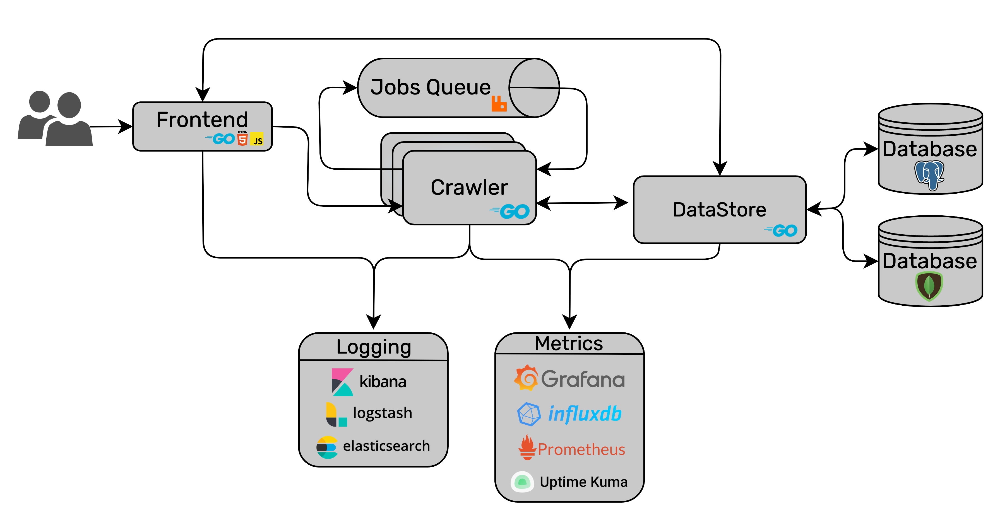

 

# neo

Generate an indepth analysis of your friend network on Steam to see exactly what kind of friends you have or find the shortest distance between two steam users. This project is my NUIG CS&IT Final Year Project 2022.

## Deployment

Neo is a distributed system deployed across 9 servers hosted mostly by OVH. Visit the deployed project at [neofyp.com](http://neofyp.com) or the [project's status page](http://status.neofyp.com/status)

| Service     | Tests | Deploy |  
| ----------- | ----------- | ----------- |
| Frontend      |  |   |  
| Datastore |  |   |
| Crawler      |  |   |  

## Architecture

# Gallery

| Landing Page    | Section of Shortest Distance Page | 
| ----------- | ----------- | 
|             |      |

| Section of Graph Page    | Interactive Graph Page | 
| ----------- | ----------- | 
|             |      |

# Documentation

My submitted FYP report detailing everything from planning, development and operations will be available at a later date

## Where to get started?

If you're looking to browse the codebase here are the main points of interest:

### Microservices

* [Frontend](services/frontend)
* [Crawler](services/crawler)
* [DataStore](services/datastore)

### Infrastructure

* [Logging (ELK Stack)](infrastructure/elk)
* [Metrics (Grafana, InfluxDB)](infrastructure/grafana)
* [Database (MongoDB)](infrastructure/mongoDB)
* [Database (PostgreSQL)](infrastructure/postgresql)
* [Queue/Messaging System (RabbitMQ)](infrastructure/rabbitMQ)
